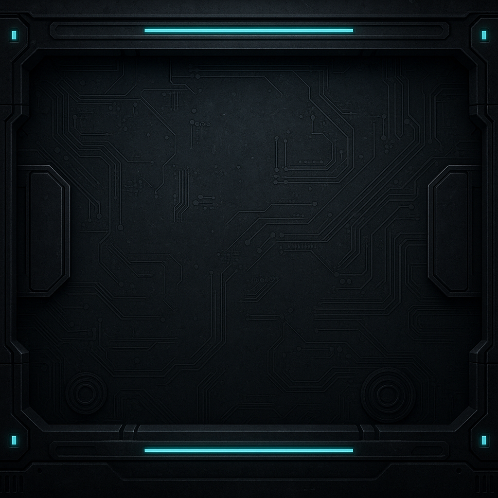

# 🔠 Morse Code Translator 🔁

Welcome to the **Morse Code Translator**, a modern and interactive React-based web app that lets you convert between English text and Morse code — complete with audio feedback and a fun sci-fi aesthetic!



---

## 🚀 Features

- 🔤 **Text to Morse Code** conversion
- 🔊 **Morse Code to Text** decoding
- 🎵 **Audio playback** for Morse code beeps (dot and dash)
- 🎧 **Background music** with volume control
- ✨ Futuristic **sci-fi font and design**
- 📱 Fully responsive & mobile-friendly

---

## 🛠️ Tech Stack

- **Frontend:** React (Vite)
- **Styling:** CSS
- **Audio Handling:** HTML5 Audio API
- **Font:** Star Jedi (custom TTF font)
- **Icons & Assets:** Custom & Open Source

---

## 📂 Folder Structure

morse-code-translator/
├── public/
│ ├── sounds/ (audio files)
│ ├── background.png
│ └── starjedi.ttf
├── src/
│ ├── components/
│ │ ├── ButtonGroup.jsx
│ │ ├── MorseInput.jsx
│ │ └── MorseOutput.jsx
│ ├── utils/
│ │ ├── beep.js
│ │ └── morse.js
│ ├── App.jsx
│ ├── index.css
│ └── main.jsx

yaml
Copy
Edit

---

## 🔧 Installation

1. **Clone the repo:**

```bash
git clone https://github.com/Sisamkele022/morse-code-translator.git
cd morse-code-translator
Install dependencies:

bash
Copy
Edit
npm install
Run the app locally:

bash
Copy
Edit
npm run dev
🌐 Live Demo
Coming soon… (You can deploy this on GitHub Pages, Vercel, or Netlify)

🙌 Acknowledgments
Special thanks to:

Star Jedi Font

ReactJS

Vite

📫 Contact
Built with ❤️ by Sisamkele

📝 License
This project is open source and free to use under the MIT License.

yaml
Copy
Edit

---

Let me know if you want to:
- Include **GIFs or live previews**
- Add a **"How It Works"** section
- Set up **GitHub Pages deployment**

Would you like me to save this to your project as a `README.md` file now?


